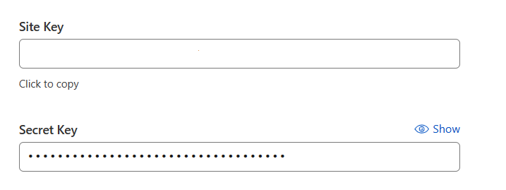
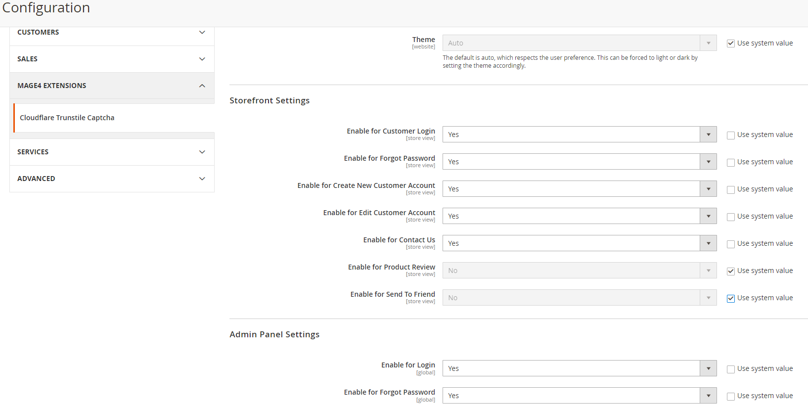
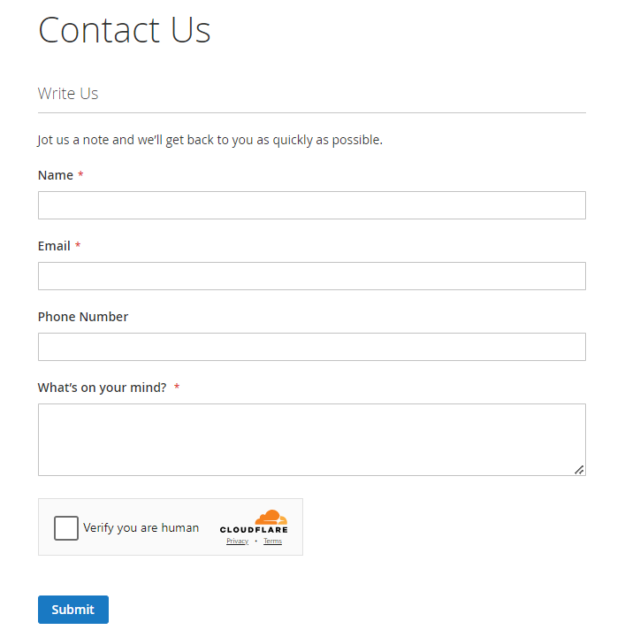
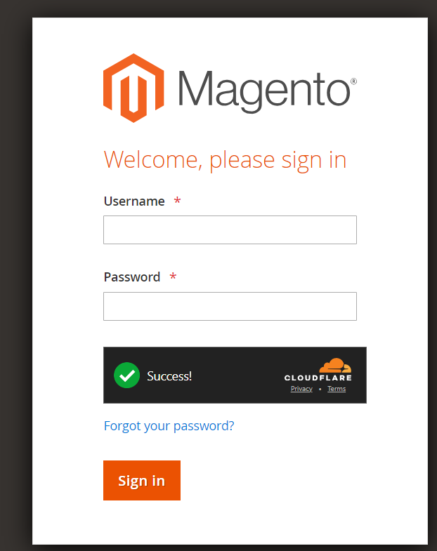
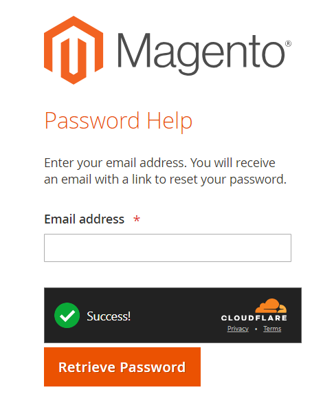

## Magento Admin Configuration:

### Generate or Copy Turnstile site key and secret key
Visit Cloudflare to create your site key and secret key and.

**New sites**
- Log in to the Cloudflare dashboard and select your account.
- Go to Turnstile.
- Select Add a site and fill out the form.
- Copy your sitekey and secret key.

**Existing sites**
- Log in to the Cloudflare dashboard and select your account.
- Go to Turnstile.
- In the widget overview, select Settings.
- Copy your sitekey and secret key.

### Magento Admin Panel Configurations
Log into Magento 2 admin panel, navigate to Stores > Configuration > MAGE4 EXTENSIONS > Cloudflare Turnstile Captcha, and enter the details.

Enter Site key and Secret key that was copied from CloudFlare Turnstile dasboard.

The admin can set for various storefront visibility of Cloudflare Turnstile. Like Customer Account Login, Customer Account Forgot Password, Create New Account, Edit Customer Account, Contact Us, Product Review and Send To Fried forms!

